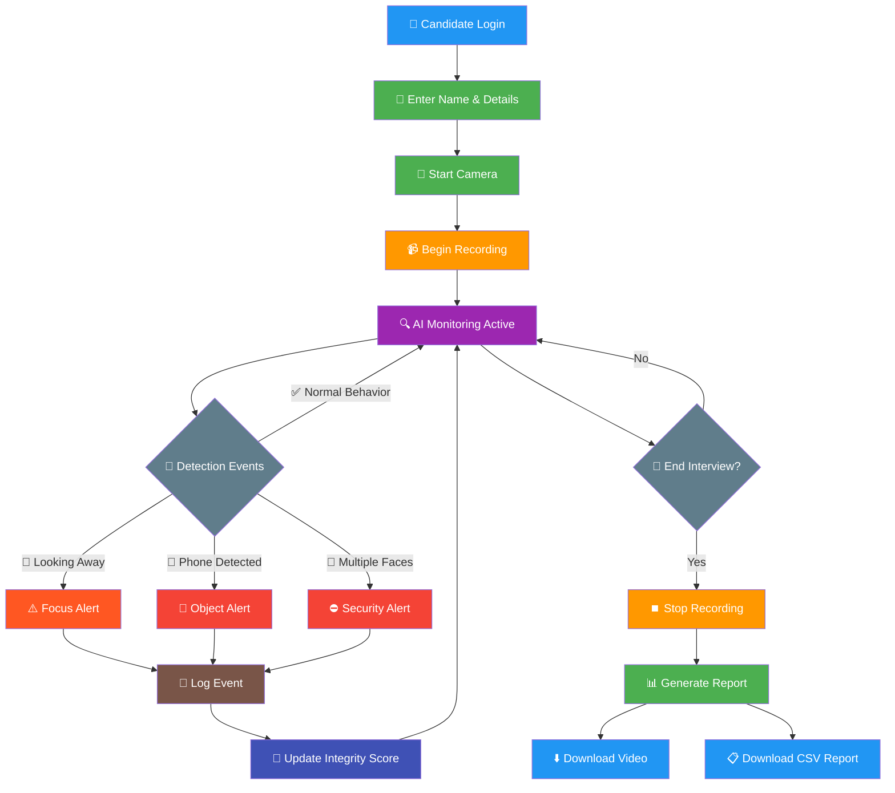
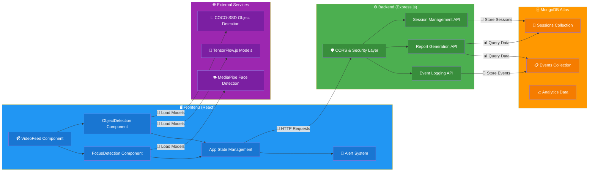

# 🎥 Tutedude Proctoring System

A comprehensive **AI-powered video proctoring system** designed for online interviews and examinations. This system ensures academic integrity through real-time monitoring, intelligent detection algorithms, and automated reporting.

**👨‍💻 Developer**: Rajiv Kumar  
**🌐 Portfolio**: [https://portfolio-rajiv-kumar.vercel.app/](https://portfolio-rajiv-kumar.vercel.app/)  
**📧 Email**: rajivkumarbth111@gmail.com  
**📂 Repository**: [https://github.com/iwanturequity/Tutedude-assignment](https://github.com/iwanturequity/Tutedude-assignment)

[]()
[](https://www.mongodb.com/atlas)
[](https://reactjs.org/)
[](https://nodejs.org/)

---

## 🎯 Core Features

### 📹 **Video Recording & Monitoring**
- **Real-time video capture** using HTML5 MediaRecorder API
- **Download recorded sessions** in WebM format
- **Live video feed** with detection overlay visualization

### 🧠 **Intelligent Detection Systems**
- **Focus Detection**: Monitors eye gaze and attention patterns
  - Detects looking away from screen (>5 seconds threshold)
  - Identifies absence of face (>10 seconds threshold) 
  - Flags multiple faces in frame simultaneously
- **Object Detection**: AI-powered identification of prohibited items
  - Mobile phones and electronic devices
  - Books, notes, and written materials
  - Additional hardware (keyboards, laptops, etc.)

### 📊 **Event Logging & Analytics**
- **Real-time event logging** with precise timestamps
- **Integrity score calculation** based on violation severity
- **Session management** with unique identifier tracking
- **MongoDB integration** for persistent data storage

### 🚨 **Alert System**
- **Audio notifications** with customizable beep sounds
- **Browser notifications** for immediate awareness
- **Real-time visual indicators** in the interface

### 📈 **Comprehensive Reporting**
- **Dual CSV generation**: Client-side and server-side options
- **Detailed event logs** with metadata and context
- **Summary statistics** including integrity scoring
- **Professional report formatting** ready for review

---

## 🔄 User Flow Diagram



---

## Data Flow Diagram



---

## 📋 Component Responsibility Map

### 🖥️ **Frontend Responsibilities**
| Component | Role | Key Features |
|-----------|------|-------------|
| **VideoFeed** | Camera management & recording | • Camera access & permission handling<br>• Video recording with MediaRecorder API<br>• Canvas rendering for detection overlay |
| **FocusDetection** | Attention monitoring | • Face landmark detection via MediaPipe<br>• Gaze direction analysis<br>• Multiple face identification |
| **ObjectDetection** | Prohibited item scanning | • Real-time object classification<br>• COCO-SSD model integration<br>• Bounding box visualization |
| **App (Main)** | State orchestration | • Event aggregation & logging<br>• Integrity score calculation<br>• Report generation & download |
| **Alert System** | User notifications | • Audio alert playback<br>• Browser notification API<br>• Visual status indicators |

### ⚙️ **Backend Responsibilities**
| Service | Role | Key Features |
|---------|------|-------------|
| **Express Server** | API gateway | • RESTful endpoint management<br>• CORS configuration<br>• Request validation & sanitization |
| **Event Logging** | Data persistence | • Real-time event storage<br>• Batch processing capabilities<br>• Data integrity validation |
| **Report Generation** | Analytics engine | • CSV report compilation<br>• Statistical analysis<br>• Data export formatting |
| **Session Management** | User tracking | • Interview session lifecycle<br>• Candidate identification<br>• Duration tracking |

### 🗄️ **Database Responsibilities**
| Collection | Purpose | Schema |
|------------|---------|---------|
| **Events** | Activity logs | `candidateId`, `eventType`, `timestamp`, `metadata` |
| **Sessions** | Interview tracking | `sessionId`, `candidateInfo`, `startTime`, `endTime`, `integrityScore` |

---

## 🛠️ Tech Stack

### **Frontend Technologies**
```json
{
  "framework": "React 18+ with Vite",
  "ai_models": [
    "TensorFlow.js 4.x",
    "MediaPipe Face Mesh",
    "COCO-SSD Object Detection"
  ],
  "media": "HTML5 MediaRecorder API",
  "styling": "CSS-in-JS (Styled Components)",
  "state": "React Hooks (useState, useEffect)"
}
```

### **Backend Technologies**
```json
{
  "runtime": "Node.js 16+",
  "framework": "Express.js 4.x",
  "database": "MongoDB Atlas (Cloud)",
  "auth": "CORS enabled",
  "validation": "Custom middleware"
}
```

### **Development & Deployment**
```json
{
  "bundler": "Vite 7.x",
  "linting": "ESLint 9.x",
  "deployment": "Vercel (Frontend) + Railway/Heroku (Backend)",
  "version_control": "Git with GitHub"
}
```

---

## 📁 Project Structure

```
tutedude-assignment/
├── 📁 backend/                     # Express.js API server
│   ├── server.js                   # Main server file with MongoDB integration
│   ├── package.json                # Backend dependencies
│   └── .env                        # Environment variables (MongoDB URI, etc.)
├── 📁 public/                      # Static assets
│   └── vite.svg                    # Application favicon
├── 📁 samples/                     # Sample outputs and documentation
│   └── report.csv                  # Example proctoring report
├── 📁 src/                         # Frontend source code
│   ├── 📁 components/              # React components
│   │   ├── VideoFeed.jsx           # Camera management & recording
│   │   ├── FocusDetection.jsx      # Face tracking & attention monitoring
│   │   └── ObjectDetection.jsx     # AI-powered object recognition
│   ├── 📁 utils/                   # Utility functions and helpers
│   │   ├── detectionHelpers.js     # Detection thresholds & configurations
│   │   ├── alertHelpers.js         # Audio alerts & browser notifications
│   │   ├── apiHelpers.js           # Backend API communication
│   │   └── csvHelpers.js           # Report generation utilities
│   ├── App.jsx                     # Main application component
│   ├── main.jsx                    # React application entry point
│   └── index.css                   # Global styles
├── eslint.config.js                # Code linting configuration
├── index.html                      # HTML template
├── package.json                    # Frontend dependencies & scripts
├── README.md                       # Project documentation
└── vite.config.js                  # Vite bundler configuration
```

---

## 🚀 Quick Start

### **Prerequisites**
- Node.js 16+ installed
- MongoDB Atlas account (free tier available)
- Modern web browser with camera access
- Git for repository management

### **Installation Steps**

#### **1️⃣ Clone Repository**
```bash
git clone https://github.com/iwanturequity/Tutedude-assignment
cd Tutedude-assignment
```

#### **2️⃣ Backend Setup**
```bash
# Navigate to backend directory
cd backend

# Install dependencies
npm install

# Configure environment variables
# Edit .env file with your MongoDB Atlas connection string
echo "MONGODB_URI=your_mongodb_connection_string" >> .env
echo "PORT=5000" >> .env
echo "NODE_ENV=development" >> .env

# Start backend server
npm start
```

**✅ Backend should now be running on http://localhost:5000**

#### **3️⃣ Frontend Setup** 
```bash
# Return to root directory (new terminal)
cd ..

# Install frontend dependencies  
npm install

# Start development server
npm run dev
```

**✅ Frontend should now be running on http://localhost:5173**

#### **4️⃣ Access Application**
Open your browser and navigate to: **http://localhost:5173**

### **📋 Quick Test Checklist**
- [ ] Camera permission granted
- [ ] Backend connection indicator shows "Connected" 
- [ ] Alert system shows "Enabled"
- [ ] Enter candidate name and start camera
- [ ] Test focus detection by looking away
- [ ] Test object detection with phone/book
- [ ] Download CSV report successfully

---

## 📊 API Documentation

### **Base URL**: `http://localhost:5000`

| Method | Endpoint | Description | Request Body |
|--------|----------|-------------|--------------|
| `GET` | `/health` | Server health check | None |
| `POST` | `/events` | Log proctoring event | `{candidateId, eventType, message, sessionId}` |
| `GET` | `/reports/:candidateId` | Get candidate report | None |
| `GET` | `/report/csv/:candidateId` | Download CSV report | None |
| `POST` | `/sessions` | Create/update session | `{sessionId, candidateId, startTime, endTime}` |

---

## 🎯 Integrity Scoring System

| Event Type | Point Deduction | Severity |
|------------|----------------|----------|
| Looking Away (>5s) | -5 points | ⚠️ Warning |
| No Face Detected | -5 points | ⚠️ Warning |
| Multiple Faces | -10 points | 🚨 Critical |
| Phone Detected | -10 points | 🚨 Critical |
| Books/Notes | -10 points | 🚨 Critical |
| Electronic Devices | -8 points | ⚠️ Warning |

**Grading Scale:**
- 🟢 **70-100**: Pass (High Integrity)
- 🟡 **50-69**: Warning (Moderate Concerns)  
- 🔴 **0-49**: Fail (Multiple Violations)

---

## 🌐 Deployment

### **Frontend (Vercel)**
```bash
npm run build
# Deploy the dist/ folder to Vercel
```

### **Backend (Railway/Heroku)**
```bash
# Add to package.json in backend/
"scripts": {
  "start": "node server.js"
}

# Set environment variables:
# MONGODB_URI=your_connection_string
# PORT=5000
```

---

## 🤝 Contributing

1. **Fork** the repository
2. **Create** feature branch (`git checkout -b feature/AmazingFeature`)
3. **Commit** changes (`git commit -m 'Add some AmazingFeature'`)
4. **Push** to branch (`git push origin feature/AmazingFeature`) 
5. **Open** a Pull Request

---

## 📄 License

This project is licensed under the **MIT License** - see the [LICENSE](LICENSE) file for details.

---

## 👨‍💻 Author

## �‍💻 Developer

**Rajiv Kumar**
- 🌐 Portfolio: [https://portfolio-rajiv-kumar.vercel.app/](https://portfolio-rajiv-kumar.vercel.app/)
- 📧 Email: rajivkumarbth111@gmail.com
- 📂 GitHub: [https://github.com/iwanturequity](https://github.com/iwanturequity)
- 🔗 Repository: [https://github.com/iwanturequity/Tutedude-assignment](https://github.com/iwanturequity/Tutedude-assignment)

---

## 🙏 Acknowledgments

- **TensorFlow.js Team** for machine learning capabilities
- **Google MediaPipe** for advanced face detection
- **MongoDB Atlas** for reliable cloud database hosting
- **React Community** for excellent documentation and support
- **Vite Team** for lightning-fast development experience

---

<div align="center">

**⭐ Star this repository if it helped you!**
</div>

